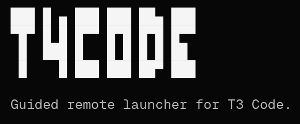

<div align="center">



_Launcher for exposing T3 Code over a Tailscale tailnet._

</div>

## Install

```bash
bunx @maria_rcks/t4code
# or
npx @maria_rcks/t4code
# or
npm install -g @maria_rcks/t4code
# then
t4code
```

## What it does

- Verifies Tailscale connectivity.
- Verifies Codex CLI availability and auth.
- Launches T3 in web mode on your tailnet IP.
- Shows the remote URL and QR code in a compact terminal UI.

## Credits

- [@kitlangton](https://github.com/kitlangton) for Tailcode.
  - sorry for the slopfork kit
- [@juliusmarminge](https://github.com/juliusmarminge) & [@t3dotgg](https://github.com/t3dotgg) for T3 Code.
